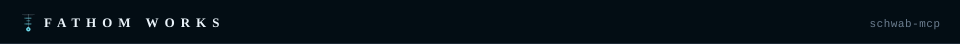

<p align="center"></p>

# `$ schwab-mcp`

**Lets an AI assistant such as Claude read your Charles Schwab account: quotes, positions, orders, history and option chains.** You ask in plain English; the assistant fetches the data. It can also place orders if you let it.

**In plain terms:** this is a small service you run yourself. It connects your Schwab account to an AI assistant. MCP (Model Context Protocol) is a plug-in standard that lets an AI assistant use outside tools.

*A [Fathom Works](https://github.com/Jemplayer82) project. Fork of [sudowealth/schwab-mcp](https://github.com/sudowealth/schwab-mcp), with Docker packaging, a saved token store, automatic token refresh and a stateless HTTP transport added.*

> [!WARNING]
> **Use at your own risk.** Not financial advice.

## `[ before you start ]`

1. **Schwab developer app.** Register at [developer.schwab.com](https://developer.schwab.com). You need a `Client ID`, `Client Secret`, and a registered callback URL.
2. **Docker.** The server runs as a container.

> [!WARNING]
> The callback URL must match `SCHWAB_REDIRECT_URI` exactly.
> Local: `http://localhost:8000/callback`
> Deployed: your public URL + `/callback`

## `[ quick start ]`

Start the server with one Docker command (recommended).

```bash
$ docker run -d \
  --name schwab-mcp \
  -p 8000:8000 \
  -v schwab-tokens:/data \
  -e SCHWAB_CLIENT_ID=your_client_id \
  -e SCHWAB_CLIENT_SECRET=your_client_secret \
  -e SCHWAB_REDIRECT_URI=http://localhost:8000/callback \
  ghcr.io/jemplayer82/schwab-mcp:latest
```

Or run it with Docker Compose.

```yaml
services:
  schwab-mcp:
    image: ghcr.io/jemplayer82/schwab-mcp:latest
    pull_policy: always
    ports:
      - "3105:8000"
    environment:
      SCHWAB_CLIENT_ID: ${SCHWAB_CLIENT_ID}
      SCHWAB_CLIENT_SECRET: ${SCHWAB_CLIENT_SECRET}
      SCHWAB_REDIRECT_URI: ${SCHWAB_REDIRECT_URI}
    volumes:
      - schwab-tokens:/data
    restart: unless-stopped

volumes:
  schwab-tokens:
```

## `[ usage ]`

**Authorize your account.** This links the server to Schwab.

1. Open `http://localhost:8000/auth` (or your deployed URL) in a browser.
2. Log in to Schwab and approve the connection.
3. You land on a "Schwab connected!" page. Close it.

**Check status.** `GET /health` returns `{ status: "ok", authenticated: true/false }`.

> [!NOTE]
> **Weekly re-auth required.** Schwab login tokens expire after 7 days. Return to `/auth` once a week. The server renews the shorter ~30-minute access token by itself.

**Connect your assistant.** Add the server to Claude Code or Claude Desktop.

```json
{
  "mcpServers": {
    "schwab": {
      "type": "http",
      "url": "http://localhost:8000/mcp"
    }
  }
}
```

Change the URL if the server runs on another machine or port. For the Claude Code command line, run this instead.

```bash
$ claude mcp add schwab --transport http http://localhost:8000/mcp
```

## `[ configuration ]`

Set these as environment variables on the container.

| Variable | Required | What it does | Default |
|---|---|---|---|
| `SCHWAB_CLIENT_ID` | Yes | Client ID from developer.schwab.com | none |
| `SCHWAB_CLIENT_SECRET` | Yes | Client secret from developer.schwab.com | none |
| `SCHWAB_REDIRECT_URI` | Yes | OAuth callback URL (must match your app registration) | none |
| `PORT` | No | Port to listen on | `8000` |
| `TOKEN_PATH` | No | Where login tokens are saved | `/data/tokens.json` |

Tokens live in the `/data` volume, so they survive container restarts.

## `[ docs ]`

- [Tools](docs/tools.md): everything the assistant can do (accounts, quotes, options, orders, transactions).
- [Development](docs/development.md): run from source, rate limits, retries, credits.

## `[ license ]`

See [LICENSE](LICENSE).


